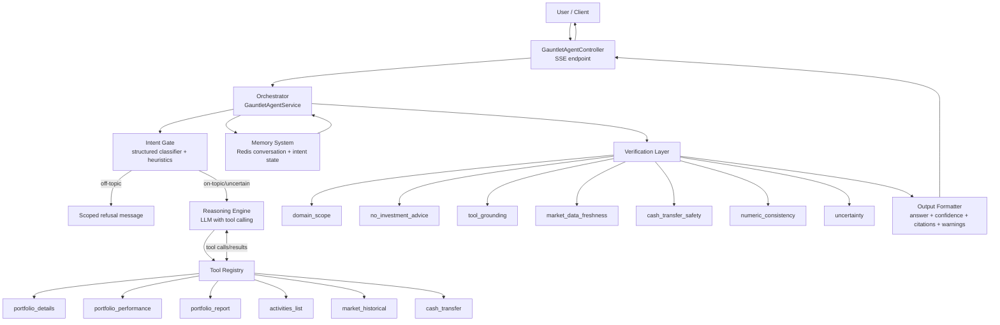

# Gauntlet Agent Architecture

## Overview
Gauntlet Agent is a finance-domain conversational agent integrated into the API layer.
It combines LLM reasoning, tool execution, persistent memory, and rule-based verification to return grounded responses with confidence and citations.

## Component Model

| Component | Requirements | Reasoning |
|---|---|---|
| **Reasoning Engine** | LLM with structured output, chain-of-thought capability | Handles intent understanding, decides when to call tools, and synthesizes final narrative responses. |
| **Tool Registry** | Defined tools with schemas, descriptions, and execution logic | Provides a typed and controlled surface for orchestrator-driven function calling. |
| **Memory System** | Conversation history, context management, state persistence | Persists short-term dialogue and intent/session cues for follow-up accuracy. |
| **Orchestrator** | Decides when to use tools, handles multi-step reasoning | Coordinates intent gate, tool loop, retries/limits, and stream lifecycle. |
| **Verification Layer** | Domain-specific checks before returning responses | Applies policy, grounding, and consistency checks before response release. |
| **Output Formatter** | Structured responses with citations and confidence | Normalizes output for frontend rendering and telemetry-friendly consumption. |

## Runtime Architecture

### Entry Point
- Endpoint: `POST /gauntlet-agent/chat/stream`
- Controller: `apps/api/src/app/gauntlet-agent/orchestrator/gauntlet-agent.controller.ts`
- Transport: Server-Sent Events (SSE)

### Orchestrator
- Service: `apps/api/src/app/gauntlet-agent/orchestrator/gauntlet-agent.service.ts`
- Responsibilities:
  - Domain intent gate (on-topic/off-topic/uncertain)
  - LLM setup and tool binding
  - Iterative tool execution loop (`maxToolRounds`)
  - Clarification handling for incomplete arguments
  - Verification and formatting
  - Persistence of conversation and intent state

### Tool Registry
- Registry: `apps/api/src/app/gauntlet-agent/tools/tool.registry.ts`
- Current tools:
  - `portfolio_details`
  - `portfolio_performance`
  - `portfolio_report`
  - `activities_list`
  - `market_historical`
  - `cash_transfer`

### Memory System
- Service: `apps/api/src/app/gauntlet-agent/memory-system/conversation-memory.service.ts`
- Backing store: Redis (`RedisCacheService`)
- Stores:
  - Conversation turns (`human` / `ai`)
  - Intent state:
    - `lastIntent`
    - `lastToolUsed`
    - `recentEntities`
    - `pendingClarification`
    - `updatedAt`
- Default TTL: 7 days (configurable)

### Verification Layer
- Verifier: `apps/api/src/app/gauntlet-agent/verification-layer/verifier.ts`
- Rule order:
  1. `domain_scope`
  2. `no_investment_advice`
  3. `tool_grounding`
  4. `market_data_freshness`
  5. `cash_transfer_safety`
  6. `numeric_consistency`
  7. `uncertainty`
- Verdict model: `PASS | WARN | REWRITE | BLOCK`
- Behavior:
  - `BLOCK`: hard-block message and stop
  - `REWRITE`: replace draft response with safe rewrite
  - `WARN`: keep response with warnings metadata

### Output Formatter
- File: `apps/api/src/app/gauntlet-agent/formatter/output-formatter.ts`
- Output contract:
  - `answer: string`
  - `confidence: number`
  - `citations: { source, evidence }[]`
  - `warnings: string[]`
  - `verdict`
  - `reasons: string[]`
- Confidence is derived from verification verdict + citation count + reason penalties.

## System Diagram

## End-to-End Flow
1. Client sends user message (optional `conversationId`).
2. Orchestrator loads recent history and intent state from memory.
3. Intent gate classifies query and applies follow-up heuristics.
4. If in-scope, orchestrator invokes LLM with registered tools.
5. Tool calls execute; outputs are captured as evidence snippets.
6. Draft response enters verification pipeline.
7. Final response is formatted with confidence/citations/warnings.
8. Conversation + intent state are persisted.
9. SSE stream returns token chunks and final structured payload.

## Security and Safety
- Permission-gated endpoint (`readAiPrompt`)
- JWT + permission guards
- Domain scope blocking for out-of-domain requests
- Investment advice rewrite guard
- Cash transfer confirmation protection
- Numeric/tool grounding checks to reduce unsupported claims

## Future Enhancements
- Tool schema enforcement with stricter runtime validation
- Per-rule explainability metrics in dashboards
- Adaptive confidence calibration using eval datasets
- Multi-model fallback for degraded tool or model states
