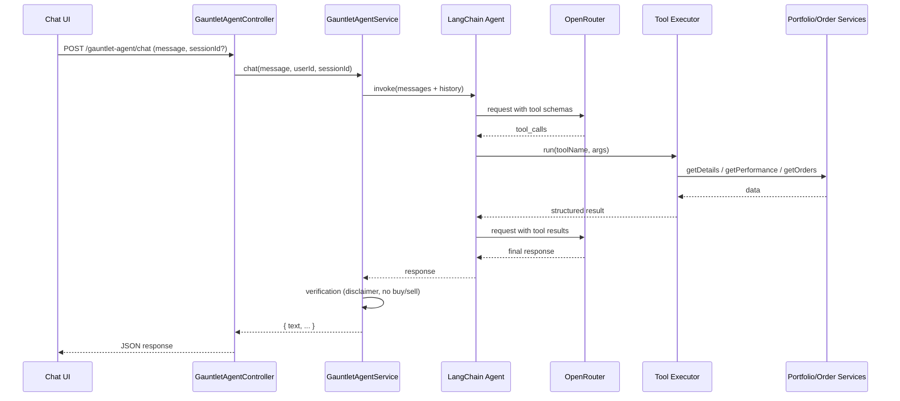

# GauntletAI MVP — Architecture Plan & Phase-Wise Implementation

**Version:** 1.0  
**Scope:** MVP (gate R1–R9)  
**Source:** [PRD_MVP.md](./PRD_MVP.md), [ARCHITECTURE_OPTIONS_AND_QUESTIONS.md](./ARCHITECTURE_OPTIONS_AND_QUESTIONS.md)

---

## 1. Locked Decisions

| # | Decision | Choice | Rationale |
|---|----------|--------|-----------|
| 1 | Module placement | **New GauntletAI module** (`apps/api/src/app/gauntlet-agent/`) | Clear separation from existing AI endpoint; easier to test and document; aligns with PROJECT_OVERVIEW. |
| 2 | Agent framework | **LangChain.js** | Agent + tools + in-memory memory out of the box; good fit for NestJS (inject services into tools). |
| 3 | LLM | **Default OpenRouter** (existing config) | Reuse `PROPERTY_API_KEY_OPENROUTER` and `PROPERTY_OPENROUTER_MODEL`; ensure chosen model supports tool/function calling. |
| 4 | Conversation history | **In-memory** (Map by session id) | No extra infra; sufficient for single-instance MVP; can move to Redis later. |
| 5 | Tools (MVP) | **portfolio_details**, **portfolio_performance**, **activities_list** | Map to PortfolioService and OrderService; covers “how is my portfolio?”, performance, and transactions. |
| 6 | Verification | **Disclaimer injection** + **no buy/sell advice** (system prompt + light check) | Fast to implement; satisfies “at least one domain-specific verification.” |
| 7 | Chat interface | **Minimal standalone** (single page calling agent API) | Quick to ship; can be served by API or static host; auth via token in header or query. |
| 8 | Deployment | **Railway** | One deploy for API (+ optional static chat); public URL for gate. |
| 9 | Evaluation | **Automated script** (Node/ts) + **short runbook** in EVAL_DATASET.md | 5+ test cases with pass/fail; script in `GauntletAI/eval/`. |

---

## 2. Architecture Overview

### 2.1 Request Flow

```
┌─────────────┐     HTTP (JWT)      ┌──────────────────────────────────────────────────────────┐
│  Chat UI    │ ──────────────────► │  Ghostfolio API (NestJS)                                 │
│  (static)   │                     │  ┌─────────────────────────────────────────────────────┐ │
└─────────────┘                     │  │  GauntletAgentModule                                 │ │
                                    │  │  ┌─────────────┐  ┌─────────────┐  ┌───────────────┐ │ │
                                    │  │  │ Controller  │─►│ Agent       │─►│ LangChain     │ │ │
                                    │  │  │ POST /chat  │  │ Service     │  │ Agent + Tools │ │ │
                                    │  │  └─────────────┘  └──────┬──────┘  └───────┬───────┘ │ │
                                    │  │                          │                 │         │ │
                                    │  │                          │                 ▼         │ │
                                    │  │                          │         ┌───────────────┐│ │
                                    │  │                          │         │ OpenRouter    ││ │
                                    │  │                          │         │ (tool-calling)││ │
                                    │  │                          │         └───────────────┘│ │
                                    │  │                          │                 │         │ │
                                    │  │                          │    tool call    ▼         │ │
                                    │  │                          │         ┌───────────────┐│ │
                                    │  │                          └────────►│ Tool Executor ││ │
                                    │  │                                    │ (3 tools)     ││ │
                                    │  │                                    └───────┬───────┘│ │
                                    │  │                                            │        │ │
                                    │  └────────────────────────────────────────────┼────────┘ │
                                    │                                                 │         │
                                    │  ┌──────────────────────────────────────────────▼────────┐ │
                                    │  │  Ghostfolio services: PortfolioService, OrderService  │ │
                                    │  └──────────────────────────────────────────────────────┘ │
                                    └──────────────────────────────────────────────────────────┘
```

### 2.2 Mermaid Diagram (optional)



### 2.3 Component Responsibilities

| Component | Responsibility |
|-----------|-----------------|
| **GauntletAgentController** | Auth (JWT), parse body (message, optional sessionId), call AgentService, return JSON. |
| **GauntletAgentService** | Create/load LangChain agent with OpenRouter and 3 tools; manage in-memory session store; run agent; apply verification (disclaimer, no buy/sell); return synthesized text. |
| **Tool definitions** | LangChain tool schemas (name, description, args) for portfolio_details, portfolio_performance, activities_list. |
| **Tool executor** | Resolve tool name → call Ghostfolio service (PortfolioService, OrderService) with userId/filters; return structured JSON. |
| **Session store** | In-memory `Map<sessionId, BaseMessage[]>`; sessionId = userId or generated per client session. |

---

## 3. Folder & File Layout

```
apps/api/src/app/gauntlet-agent/
├── gauntlet-agent.module.ts      # Nest module; imports Portfolio, Order, etc.
├── gauntlet-agent.controller.ts  # POST /gauntlet-agent/chat
├── gauntlet-agent.service.ts     # Agent orchestration, session store, verification
├── tools/
│   ├── tools.module.ts           # (if needed for DI)
│   ├── tool.registry.ts          # Build LangChain tools (inject services)
│   ├── portfolio-details.tool.ts # portfolio_details
│   ├── portfolio-performance.tool.ts
│   └── activities-list.tool.ts
├── verification/
│   └── response-verifier.ts      # Append disclaimer; check for buy/sell phrasing
└── session/
    └── memory-store.service.ts   # In-memory Map<sessionId, messages>

GauntletAI/
├── ARCHITECTURE_MVP.md           # This document
├── ARCHITECTURE_OPTIONS_AND_QUESTIONS.md
├── EVAL_DATASET.md               # 5+ test cases, pass criteria, runbook
└── eval/
    ├── run-mvp-eval.ts           # Script: call agent API, assert outcomes
    └── cases/                    # (optional) JSON/TS case definitions
```

**API route:** e.g. `POST /api/v1/gauntlet-agent/chat` (align with existing API versioning).

**Chat UI:** Single HTML/JS file or tiny app; can live in `apps/client/public/` or a small `apps/agent-chat/` for Railway static serve.

---

## 4. Phase-Wise Implementation Plan

### Phase 1 — Foundation (Module + One Tool + Agent Loop)

**Goal:** One end-to-end flow: user message → agent → single tool call → synthesized response.

| Step | Task | Deliverable |
|------|------|-------------|
| 1.1 | Create `gauntlet-agent` module and register in app. | `GauntletAgentModule` importable; empty controller. |
| 1.2 | Add OpenRouter ChatOpenAI (or equivalent) in LangChain with tool-calling model; read API key/model from PropertyService. | LLM instance usable in Node. |
| 1.3 | Implement **portfolio_details** tool: schema + executor calling `PortfolioService.getDetails(userId, …)`. | Tool returns structured summary/allocation. |
| 1.4 | Wire LangChain agent: system prompt (finance, no buy/sell), 1 tool, no history yet. | Agent invokes tool and returns one reply. |
| 1.5 | Add `POST /gauntlet-agent/chat` with JWT auth; body: `{ message }`; call agent; return `{ text }`. | Endpoint returns synthesized answer for “How is my portfolio?”. |

**Exit criteria:** Authenticated request with “What’s my portfolio allocation?” returns a natural-language answer using portfolio_details data.

---

### Phase 2 — Chat UI (Minimal)

**Goal:** Minimal chat interface so you can test the agent from the browser right after Phase 1.

| Step | Task | Deliverable |
|------|------|-------------|
| 2.1 | Minimal chat UI: one page with input and send; calls `POST /api/v1/gauntlet-agent/chat` with Authorization header (or token in env); displays `text`; optional sessionId for multi-turn. | Static page or minimal app. |
| 2.2 | Serve chat UI (e.g. from API static route or `apps/client/public/` or small standalone app); ensure CORS and auth work for local dev. | UI reachable locally. |
| 2.3 | Smoke test: open UI → log in or set token → send “How is my portfolio?” → receive response. | End-to-end flow via UI. |

**Exit criteria:** You can use the chat UI to talk to the agent (single tool) and see replies; sets you up for testing all later phases through the UI.

---

### Phase 3 — All 3 Tools + Structured Results

**Goal:** All three MVP tools implemented and agent can choose among them.

| Step | Task | Deliverable |
|------|------|-------------|
| 3.1 | Implement **portfolio_performance** tool: `PortfolioService.getPerformance(userId, …)`. | Tool returns time series / metrics (structured). |
| 3.2 | Implement **activities_list** tool: `OrderService.getOrders(…)` with sensible defaults (e.g. last 30 days). | Tool returns list of activities (structured). |
| 3.3 | Register all 3 tools with the agent. | Agent can select any of the 3 from natural language. |
| 3.4 | Ensure tool results are passed back to LLM as structured content (no raw dump); handle tool errors (try/catch, return error payload). | AC-3.1, AC-3.2 satisfied. |

**Exit criteria:** From the chat UI, queries for “How did I perform?”, “Recent transactions”, and “Portfolio summary” each trigger the correct tool and return a coherent answer.

---

### Phase 4 — Conversation History (Multi-Turn)

**Goal:** Conversation history maintained across turns; follow-up questions work.

| Step | Task | Deliverable |
|------|------|-------------|
| 4.1 | Add in-memory session store: `Map<sessionId, BaseMessage[]>`. SessionId from body or derive from userId + optional client id. | `MemoryStoreService` or equivalent. |
| 4.2 | Before invoking agent: load history for sessionId; append user message; invoke agent; append assistant message and tool messages to history; persist. | Multi-turn context available to LLM. |
| 4.3 | API contract: accept `sessionId` (optional) in body; return same in response so client can send follow-ups. | AC-5.1, AC-5.2. |
| 4.4 | Chat UI: send and display sessionId so follow-ups use same session. Add at least one test case: follow-up that depends on previous turn (e.g. “What about last month?”). | Document in EVAL_DATASET.md. |

**Exit criteria:** Two messages in same session in the UI; second message references first; agent response is contextually correct.

---

### Phase 5 — Error Handling & Verification

**Goal:** Graceful failures; at least one domain verification.

| Step | Task | Deliverable |
|------|------|-------------|
| 5.1 | Invalid/missing tool params: catch in tool executor; return structured error to agent; agent can say “I couldn’t get that data.” | AC-6.1. |
| 5.2 | Backend/API failures (e.g. PortfolioService throws): catch in executor; return error payload; no process crash; user sees graceful message. | AC-6.2. |
| 5.3 | Out-of-domain/unsupported: system prompt states “only portfolio and finance”; optional guard that detects clearly off-topic and returns fixed message. | AC-6.3. |
| 5.4 | **Disclaimer:** Append short disclaimer to every agent response (e.g. “This is for information only; not investment advice.”). | AC-7.1, AC-7.2. |
| 5.5 | **No buy/sell advice:** In system prompt forbid specific buy/sell recommendations; optionally post-process response to detect and rephrase. | Second verification. |

**Exit criteria:** Invalid params and backend errors don’t crash; responses include disclaimer; no explicit buy/sell advice in sample queries (test via chat UI).

---

### Phase 6 — Simple Evaluation (5+ Test Cases)

**Goal:** 5+ test cases with defined outcomes and pass/fail; executable.

| Step | Task | Deliverable |
|------|------|-------------|
| 6.1 | Define ≥5 test cases in EVAL_DATASET.md: input query, expected tool(s), expected output constraints (e.g. “contains allocation”, “contains disclaimer”). | EVAL_DATASET.md. |
| 6.2 | Implement `GauntletAI/eval/run-mvp-eval.ts`: call agent API (with test user token or mock), assert status 200, optionally assert tool calls and substring in response. | Runnable script. |
| 6.3 | Document how to run (e.g. `npx ts-node GauntletAI/eval/run-mvp-eval.ts` or npm script) and record results. | AC-8.1–8.3. |

**Exit criteria:** All 5+ cases documented; script runs and pass/fail is recorded.

---

### Phase 7 — Deployment (Railway)

**Goal:** Public URL; reviewer can send a message and get a response.

| Step | Task | Deliverable |
|------|------|-------------|
| 7.1 | Deploy Ghostfolio API (and DB, Redis if used elsewhere) to Railway; set env (OpenRouter key, DB URL, etc.). | Public API URL. |
| 7.2 | Point chat UI to deployed API URL (or serve UI from same deploy); ensure CORS and auth work in production. | Agent interface reachable at public URL. |
| 7.3 | Smoke test: open public URL → send “How is my portfolio?” → receive response. | R9 satisfied. |

**Exit criteria:** Public URL; agent interface reachable; one full flow works in production.

---

## 5. Phase Summary & Order

| Phase | Focus | MVP requirements covered |
|-------|--------|---------------------------|
| **1** | Foundation — module, 1 tool, agent loop | R1, R2 (1 tool), R3, R4 (partial) |
| **2** | Chat UI (minimal) | Enables testing all later phases via UI |
| **3** | All 3 tools | R2, R3, R4 |
| **4** | Conversation history | R5 |
| **5** | Error handling + verification | R6, R7 |
| **6** | Evaluation | R8 |
| **7** | Deployment (Railway) | R9 |

Implement in order 1 → 7. After Phase 2 you have a working UI to drive the agent; Phases 3–5 complete the agent behavior; Phase 6 adds eval; Phase 7 goes public.

---

## 6. Dependencies & Config

- **LangChain.js** (and LangChain OpenRouter integration if available, or ChatOpenAI-compatible client for OpenRouter).
- **Existing:** NestJS, PropertyService (OpenRouter API key + model), PortfolioService, OrderService, AccountService (if needed for future tools), JWT auth.
- **Env (Railway):** Same as current Ghostfolio API (DB, Redis if used, `OPENROUTER_API_KEY` / property store, etc.).

---

## 7. Document References

- [PRD_MVP.md](./PRD_MVP.md) — MVP scope and gate checklist.
- [AGENT_OBJECTIVE_AND_TOOLS.md](./AGENT_OBJECTIVE_AND_TOOLS.md) — Tool list and backend mapping.
- [ARCHITECTURE_OPTIONS_AND_QUESTIONS.md](./ARCHITECTURE_OPTIONS_AND_QUESTIONS.md) — Decision log.
- [PROJECT_OVERVIEW.md](./PROJECT_OVERVIEW.md) — Timeline and full tool list.

---

*This document is the architecture and implementation plan for the GauntletAI MVP. Implement phase by phase and tick off gate requirements as you go.*
